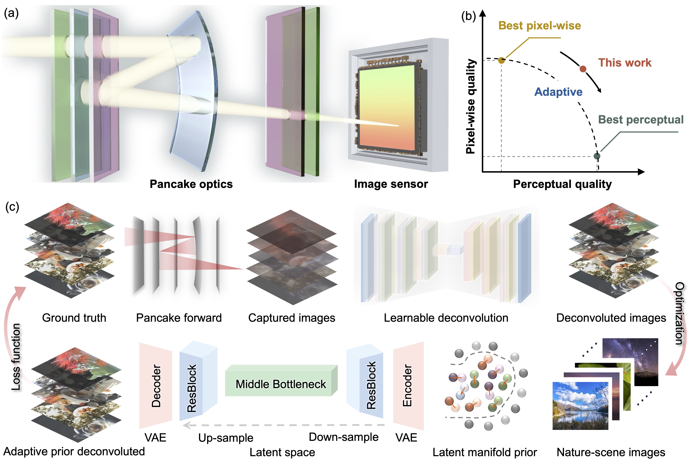

# Compact Neural Pancake Camera for High-Perceptual-Quality Foveated Imaging

> Release for Adaptive Prior Deconvolution in neural Pancake imaging.

[](Result/Figures/Introduction.pdf)

This repository accompanies the manuscript **"Compact Neural Pancake Camera for High-Perceptual-Quality Foveated Imaging"** by Jinwen Wei and Liangcai Cao *(under review)*.

**Adaptive Prior Deconvolution** is the computation imaging algorithm in this work. APD combines a learnable deconvolution network with a adaptive latent natural prior, guiding restored images toward the natural image manifold instead of relying only on pixel-wise regression. By adaptively controlling the prior strength during inference, APD improves perceptual quality while preserving pixel fidelity, enabling sharper textures and more realistic reconstruction results for compact Pancake cameras. The proposed framework could be extendable to other compact computational cameras including DOE- and metalens-based imaging systems which suggests possible applicability to flat imaging architectures.


## Release Status

This repository currently provides a partial release including representative scripts, figures, and sample images. The complete training and inference codebase will be released after the manuscript is accepted.

## Highlights

- Compact folded Pancake catadioptric imaging with a large field of view.
- Adaptive Prior Deconvolution (APD) for perceptually faithful computational imaging.
- Bio-inspired foveated imaging for bandwidth-efficient mobile and edge-device applications.

## Included in This Release

- `Code/train.py`: training entry for the dual-stage deconvolution and prior-guided pipeline.
- `Code/test.py`: inference and timestep sweep script with image-quality evaluation.
- `Code/adaptive/`: utility modules for dataset loading, metric evaluation, training, and APD wrappers.
- `Result/Figures/`: overview figures used in the manuscript.
- `Result/Images/`: sample captured images and ground-truth references.

## Repository Structure

```text
Pancake-Adaptive-Imaging-main/
├── Code/
│   ├── train.py
│   ├── test.py
│   └── adaptive/
├── Result/
│   ├── Figures/
│   └── Images/
├── LICENSE
└── README.md
```

## Related Work

This repository accompanies the 2026 manuscript **"Compact Neural Pancake Camera for High-Perceptual-Quality Foveated Imaging"** by Jinwen Wei and Liangcai Cao *(under review)*.

## Citation

If you find this repository useful, please cite:

```bibtex
@misc{pancakeadaptive2026,
  author={Jinwen Wei and Liangcai Cao},
  title={Pancake-Adaptive-Imaging},
  year={2026},
  howpublished={\url{https://github.com/THUHoloLab/Pancake-Adaptive-Imaging/}},
  note={GitHub repository}
}

```

## License

This project is licensed under the MIT License. See the [LICENSE](LICENSE) file for details.


